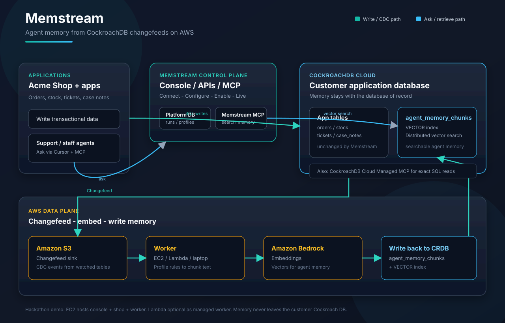
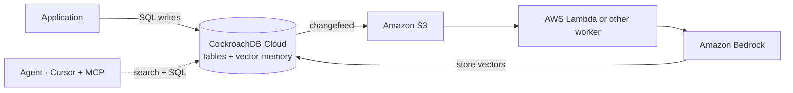

# Memstream architecture

Operator guide: [AWS.md](./AWS.md). Self-host: [SELF_HOST.md](./SELF_HOST.md).

## Product decisions

| Decision | Choice |
| --- | --- |
| Data residency | Customers keep application data and `agent_memory_chunks` in their own Cockroach database |
| Delivery | SaaS control plane first, optional self-host |
| Retrieval model | Memstream memory plus live SQL, usually through MCP |
| Worker default | Managed Lambda for cloud; EC2 for demo/self-host only |

### Non-goals

- Moving `agent_memory_chunks` into the Memstream platform DB
- Replacing the MCP ask path with a hosted chat product surface
- Full multi-region control plane in v1
- Merging platform and application DBs into one product-level connection

---

## Model

The Memstream control plane orchestrates connect, configure, enable, and observe. The customer application database stores both the application rows and the memory vectors. Workers read Cockroach changefeed output from S3, call Bedrock for embeddings, and write vectors back into the same database.

---

## Topology



Editable source: [`architecture.excalidraw`](./architecture.excalidraw). Published assets: [`architecture-diagram.svg`](./architecture-diagram.svg) and [`architecture-diagram.png`](./architecture-diagram.png).



Write path: app -> CockroachDB -> S3 -> worker -> Bedrock -> vectors in CockroachDB.  
Ask path: agent -> Memstream MCP for memory + Cockroach SQL for exact live rows.

---

## Data contract

| Store | Owner | Holds |
| --- | --- | --- |
| Platform DB | Memstream in SaaS, customer in self-host | Orgs, workspaces, encrypted connections, runs, profiles, CDC processed keys |
| Application DB | Customer always | App tables plus `agent_memory_chunks` |

Keep the two databases separate. Customers keep operational data and memory in the same application database. The platform DB is orchestration metadata, not a second vector store.

---

## SaaS vs self-host

| Concern | SaaS | Self-host |
| --- | --- | --- |
| Control plane | Memstream-hosted | Customer runs `apps/web` and the platform DB |
| Application DB | Customer-owned | Customer-owned |
| Worker default | Managed Lambda | Lambda, laptop, or EC2 |
| Secrets | Managed by Memstream infra | Managed in the customer's account |

EC2 is the demo or self-host box. It is not the default SaaS worker.

---

## Repository shape

```text
apps/web/         control plane UI + APIs (+ demo shop)
packages/engine/  CDC, profile, embed, store, enable, deploy
packages/mcp/     search_memory
sql/              memstream.sql (platform) · application.sql (app + chunks)
infra/cdk/        CDK source of truth
infra/*.yaml      Generated CloudFormation used by Enable / deploy-aws
```
